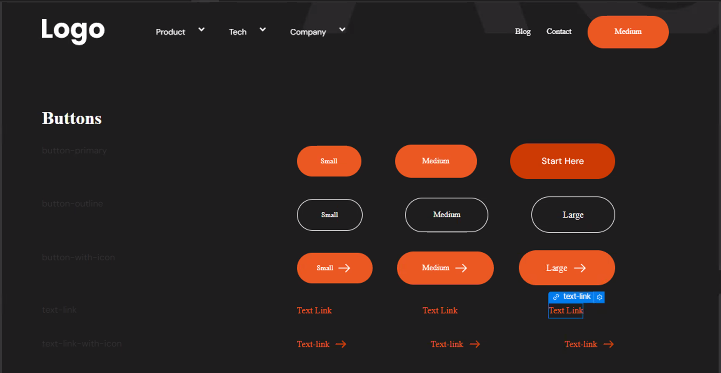
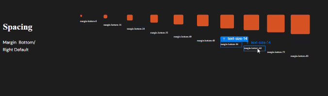

# Style Guide Preparation
## Notes:
- Designer yung gumagawa ng assets 
- Get the fonts and assets immediately when receiving the task to start a project
	- we'll see link of the link of fonts in figma, or we could find the in the `Ag`
	
  *What is the difference between ttf and woff?*
	- `ttf` is desktop use, standalone apps
	- if we're gonna use web, we should use woff and `woff2`
		- ask we have `woff` or `woff2` if ever


- Let's use Brylliant style guide as cloneable
  - this is our boilerplate

- Get the font from texts
	- link is written in figma
	- or designer uploads it in google drive
	- let's ask designer din if may discrepancy sa font
- Site settings
	- setup the fonts (use upload button)

- We usually have styleguide sa side (let's see the properties here)
- Why aren't we using the google font?
	- nasisira yung onload natin, that's why mas better naka Webflow upload tayo

- Make sure to have fallback
	- pag mahina yung net, we should have a backup font (we could use Arial)

- Variable fonts
	- we could make it easier in animation compare to individual fonts


Before going to designer, check:
- language code
- localization
- untick Webflow branding

Assets:
- export png nung logo and favicon
  - we can make our own favicon in figma `32*32`
    - create frame
    - always rename our asset to become descriptive and seo friendly
      - eg: `img-brylliant-favicon`
  - webclip `256*256`
    - create frame
    - always rename our asset to become descriptive and seo friendly
      - eg: `img-brylliant-webclip`

Publishing:
  - webflow.io domain (should be unique)
    - `${business-name}-site` (for staging)
  - advance publsihing options should be minified

Forms:
  - add email address to submission email

Custom codes:
  - make sure to have wizardry head code
  - make sure to have footer code

### Designer

- Setup Variables
  - Size Variables | Color Variables
  - container, padding, spaces, swatch
  - use variable for font family
    - use the downloaded fonts
  - colour pallete (on swatch | use hex codes)
  - add font sizes (font size / line height | 56 / 66)
    - heading and paragraphs
    - how to get the `em` value, just divie to `16`

- Go to Body(All Pages)
  - alin yung mas maraming ginagamit na font family, yun yung primary
    - usually mas marami ang paragraphs kesa sa headings that's why
  - we should inherit defaults
  - to get the line height, we'll use `unitless` (not px, not em, not percentage). 
    - Use this formula: `font size / line height divisor` | `56/66`
    - we can round the line height off if this is too long
  - heading should have classnames of `heading-${font size}`

 - Buttons
  - we can just follow the style guide
     - Formula: `given data / pixel`
  - we can copy and paste components to create another instances
    
  - no need to create components for text links

 - Spacing
   - let's follow the 12 column spacing
    
   - dapat naka wrap sa div when creating margins instead of the direct element

```html
   <div class="margin-bottom-16">
      <div>Elem</div>
    </div>
```
instead of :
```html
      <div class="margin-bottom-16">Elem</div>
```

  - Padding sections is top and bottom only
    - we should not mess with these global classes
    - creating section, use global padding, 1.5rem
      - container as 1280
        - padding could have `t` or `b` as indicator of direction

### Hover Interactions

- 
