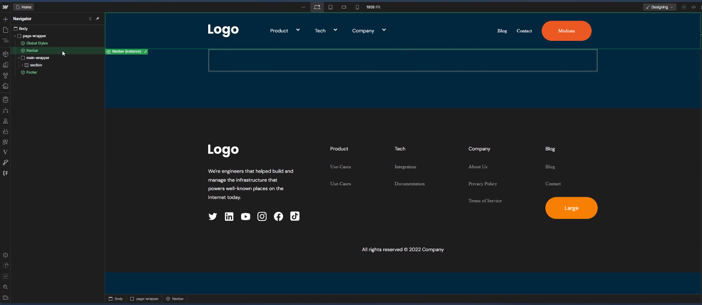
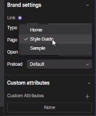
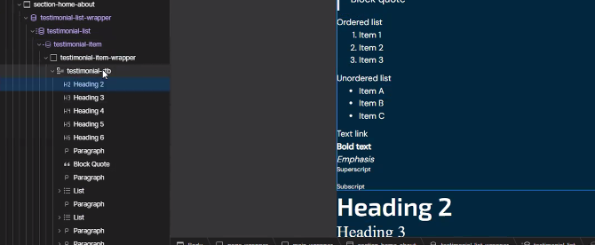
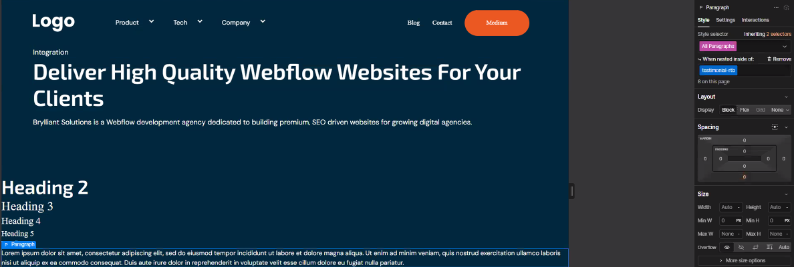
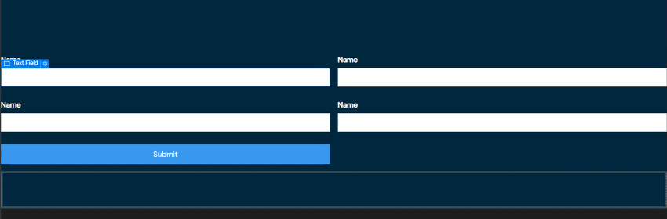

# Notes:

### Site Structure
  - HTML Semantic Tags (Nav, Main, Section, Footer)
    - always a must
    

  - If we're creating a new page we should always have
    - body
    - page-wrapper
      - Global Styles (component)
      - Navbar (component)
        - why do we use the default navbar?
          - a whole package na kasi ito for us
        - when we update links in nav menu items, make sure to use flex and align to left (for mobile)
        - make sure `Home` is selected in Brand Settings

        
      - Embed Code (if ever we need some styling injection)
        - should name it: "page-styling"
      - Main Wrapper (tag: `<main></main>`)
        - Section
          - how do we name them?
            - `section-<page name>-<section name>`
            - eg: `"section-home-hero"`
          - Page Padding
            - Container 1280
              - Padding Section 120
                - Section Wrapper (named: `<page name>-<section name>-wrapper`)

  - Heading Heirarchy
    - only one `<h1>`, one `<h2>`, others are `<h3>` and below
  - Heading, Subheading, CTA Spacing
  - Eye brow text - simple `
` block is all good
    - `<page name>-<section name>-eyebrow`
  - Div block should always set to `flex` and aligned to `left`
  - We have the `Style Selectors` tab to check  classname list
    - we have cleanup unused style
  - Footer
    - Link Block Settings - should be `Home`
    - make sure to use text span for the `year`
  - Don't add larger break points when not necessary
    - consider asset preparation
  - Assets
    - image
      - should not have space or padding, should crop image in figma
  - Class Naming
    - 99% of the elements should have class names
    - small caps, no spacing , use hyphen
    - Heading-PX Number (heading-64) 
    - Text-Size-PX Number (text-size-16)
    - Container-PX Number (container-1280)
  - Collection Items
    - naming: `<collection name>-list-wrapper`
    - testimonial-list-wrapper
      - testimonial-list
        - testimonial-item
          - testimonial-item-wrapper
          
  - Rich text
    - drill down before styling
    - we should nest them down so we don't affect the global design
      - we don't add class names directly
    - select All Paragraphs, then nest under a specific class
    
  - Slider
    - we normally use Swiper
      - name: `<page name>-<section name>-slider-wrapper`
      - slide: `<description>-slide`
  - Tabs
    - wrapper should also have class name
      - `<section name>-tabs-wrapper`
        - `<section name>-tabs-menu`
          - `<section name>-tab-link`
        - `<section name>-tabs-content`
          - `<section name>-tab-content`
  - Form Block
    - class name:
      - `<section name>-form-block`
        - `<section name>-form`
          - `<section name>-form-field`
            - `<section name>-<input type>-field` or just `<section name>-text-field`
          
    - wrap submit button in a div instead of directly styling it
      - `<section name>-form-button`
    - Success Message:
      - always update  the `form-success`'s text block

