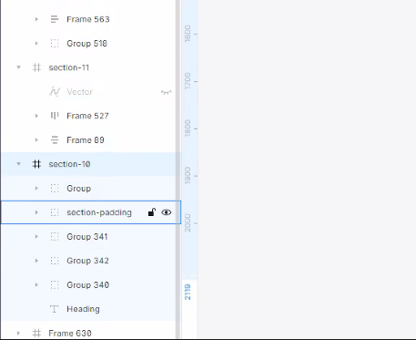
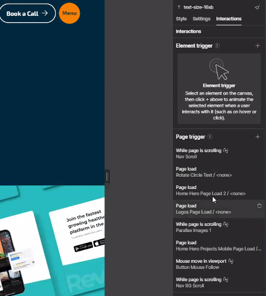
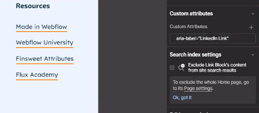
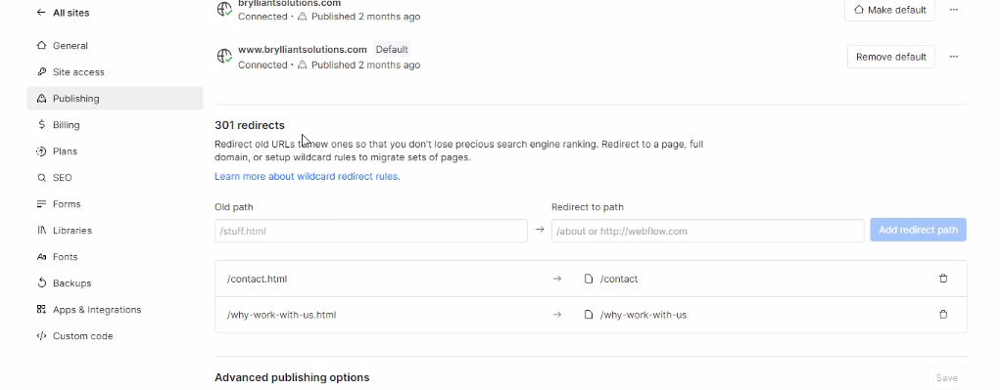

# Notes:

## Build the site from Figma design
  - Go to Section's panel on the left side
  - 


## CMS Collections
  - naming convention
    - we should use descriptive name, better to use help text for more description as well
  - images should always kave 1mb size limit only
  - we should have proper order of fields
    - we could user sort order (number) field
      - for sorting purposes in the collection items
  - CMS referencing - like how relational database works
  - use conditional visibility for Empty fields
  - formatting empty states - ask Dern to create a guide. 
  - delete collections when not in use
  - animeting CMS collections using code:
  
  - `CSS`
  ```css
    .expert-team-collection-item {
        opacity: 0;
        transition: opacity 1s ease-in-out;
    }
    .expert-team-collection-item.animate {
        opacity: 1;
    }
  ```
  - `JavaScript`
  ```js
    $(document).ready(function() {
        // Select CMS items
        const cmsItems = $('.expert-team-collection-item').get();
        // Create the observer
        let observer = new IntersectionObserver((entries) => {
            entries.forEach((entry, index) => {
            if (entry.isIntersecting) {
                setTimeout(() => {
                // Add class to animate the item
                $(entry.target).addClass('animate');
                }, 150 * index); // Stagger delay, adjust as needed
                observer.unobserve(entry.target);
            }
            });
        }, {
            threshold: 0.25
        }); // Adjust threshold as needed
        // Observe each CMS item
        cmsItems.forEach(item => {
            observer.observe(item);
        });
    });
  ```

## Form Setup

  - Make sure to use correct name of forms and fields
    - `connect@brylliantsolutions.com` or `brylliantsolutions.com`
  - Add clients email in the Site Settings before transferring - do this at the end of the project

## SEO

  - images should use 100% width and 100% height
    - image file should already have the pixel property that we need for the site instead of modifying the `` property
  - Animation
    - 
  - descriptive link names (add aria-label) 
    - 
  - fixing Page Speed Insights issue
    - `PageSpeed Insights`
  - 301 Redirects
    - 

